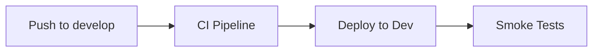
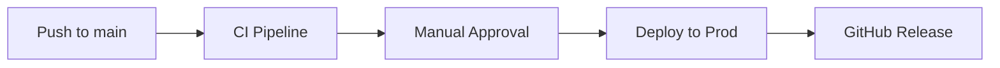
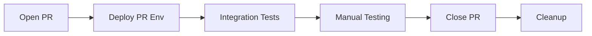

# GitHub Actions CI/CD Setup Guide

This document provides complete instructions for setting up GitHub Actions CI/CD pipelines for the Hurricane Resources application.

## Overview

The CI/CD pipeline includes:

- **Continuous Integration**: Build, test, and security scanning on every push/PR
- **Infrastructure Validation**: Bicep template validation
- **Multi-Environment Deployment**: Development, Production, and PR environments  
- **Security Scanning**: Vulnerability scanning with Trivy
- **Automated Testing**: Unit tests, integration tests, and smoke tests
- **Release Management**: Automatic GitHub releases for production deployments

## Prerequisites

### 1. Azure Service Principal Setup

Create a service principal with federated credentials for GitHub Actions:

```bash
# Login to Azure
az login

# Set variables (replace with your values)
SUBSCRIPTION_ID="your-subscription-id"
RESOURCE_GROUP="rg-hurricane-resources"
APP_NAME="hurricane-resources-github-actions"

# Create service principal
az ad sp create-for-rbac --name $APP_NAME --role contributor --scopes /subscriptions/$SUBSCRIPTION_ID --json-auth

# Note the output - you'll need clientId, tenantId, and subscriptionId
```

### 2. Configure Federated Identity Credentials

```bash
# Get the application ID from the previous step
APP_ID="your-app-id-from-previous-step"

# Create federated credential for main branch
az ad app federated-credential create \
  --id $APP_ID \
  --parameters '{
    "name": "hurricane-resources-main",
    "issuer": "https://token.actions.githubusercontent.com",
    "subject": "repo:YOUR_GITHUB_USERNAME/hurricane-resources:ref:refs/heads/main",
    "description": "Main branch deployment",
    "audiences": ["api://AzureADTokenExchange"]
  }'

# Create federated credential for develop branch
az ad app federated-credential create \
  --id $APP_ID \
  --parameters '{
    "name": "hurricane-resources-develop",
    "issuer": "https://token.actions.githubusercontent.com",
    "subject": "repo:YOUR_GITHUB_USERNAME/hurricane-resources:ref:refs/heads/develop",
    "description": "Develop branch deployment",
    "audiences": ["api://AzureADTokenExchange"]
  }'

# Create federated credential for pull requests
az ad app federated-credential create \
  --id $APP_ID \
  --parameters '{
    "name": "hurricane-resources-pr",
    "issuer": "https://token.actions.githubusercontent.com",
    "subject": "repo:YOUR_GITHUB_USERNAME/hurricane-resources:pull_request",
    "description": "Pull request deployments",
    "audiences": ["api://AzureADTokenExchange"]
  }'
```

## GitHub Repository Configuration

### 1. Repository Variables

In your GitHub repository, go to **Settings** → **Secrets and variables** → **Actions** → **Variables** and add:

| Variable Name | Value | Description |
|---------------|--------|-------------|
| `AZURE_CLIENT_ID` | `your-service-principal-client-id` | Service principal client ID |
| `AZURE_TENANT_ID` | `your-azure-tenant-id` | Azure tenant ID |
| `AZURE_SUBSCRIPTION_ID` | `your-azure-subscription-id` | Azure subscription ID |

### 2. Environment Protection Rules

Configure environment protection rules in **Settings** → **Environments**:

#### Development Environment
- **Environment name**: `development`
- **Protection rules**: None (auto-deploy)
- **Environment secrets**: None required

#### Production Environment  
- **Environment name**: `production`
- **Protection rules**: 
  - ✅ Required reviewers (add team members)
  - ✅ Wait timer: 0 minutes
  - ✅ Deployment branches: `main` only
- **Environment secrets**: None required

### 3. Branch Protection Rules

Configure branch protection for `main` branch in **Settings** → **Branches**:

- ✅ Require a pull request before merging
- ✅ Require status checks to pass before merging
  - Required status checks:
    - `Build and Test`
    - `Security Scan`
    - `Docker Build & Scan`
    - `Validate Infrastructure`
- ✅ Require branches to be up to date before merging
- ✅ Require conversation resolution before merging
- ✅ Include administrators

## Workflow Details

### Main CI/CD Pipeline (`ci-cd.yml`)

**Triggers:**
- Push to `main` or `develop` branches
- Pull requests to `main` branch  
- Manual workflow dispatch

**Jobs:**
1. **Build and Test**: Compile .NET solution, run unit tests, generate coverage
2. **Security Scan**: Check for vulnerable and deprecated packages
3. **Docker Build**: Build container images, run Trivy security scans
4. **Infrastructure Validation**: Validate Bicep templates
5. **Deploy Dev**: Deploy to development environment (develop branch)
6. **Deploy Prod**: Deploy to production environment (main branch)
7. **Cleanup**: Remove PR environments when PR is closed

### PR Environment Pipeline (`pr-deploy.yml`)

**Triggers:**
- Pull request opened, synchronized, or reopened against `main`

**Features:**
- Creates temporary environment for each PR (`pr-{number}`)
- Deploys full application stack for testing
- Posts deployment URLs as PR comment
- Runs integration tests
- Automatically cleans up when PR is closed

## Deployment Flow

### Development Deployment


### Production Deployment


### PR Testing


## Monitoring and Troubleshooting

### Viewing Logs

1. **GitHub Actions**: Go to **Actions** tab in your repository
2. **Azure Container Apps**: Use Azure Portal or CLI:
   ```bash
   az containerapp logs show --name ca-user-{hash} --resource-group rg-hurricane-resources-prod
   ```

### Common Issues

#### Authentication Failures
- Verify service principal has correct permissions
- Check federated credentials are configured for correct repository
- Ensure repository variables are set correctly

#### Build Failures
- Check .NET version compatibility
- Verify NuGet package restoration
- Review Docker build context and Dockerfile syntax

#### Deployment Failures
- Validate Bicep templates locally: `az deployment sub validate`
- Check Azure resource quotas and limits
- Verify Container Apps environment capacity

### Manual Operations

#### Force Redeploy
```bash
# Trigger manual deployment
gh workflow run ci-cd.yml --ref main
```

#### Environment Cleanup
```bash
# List environments
azd env list

# Delete specific environment
azd down --environment pr-123 --force --purge
```

## Security Best Practices

1. **Federated Identity**: Uses OpenID Connect instead of service principal secrets
2. **Least Privilege**: Service principal has minimal required permissions
3. **Environment Protection**: Production deployments require approval
4. **Vulnerability Scanning**: Trivy scans all container images
5. **Dependency Scanning**: Regular checks for vulnerable packages

## Monitoring and Alerting

Set up monitoring in Azure:

1. **Application Insights**: Monitor application performance
2. **Container Apps Metrics**: Track scaling and resource usage
3. **Log Analytics**: Centralized logging for troubleshooting
4. **Azure Alerts**: Notify on deployment failures or performance issues

## Cost Management

- **PR Environments**: Automatically cleaned up to prevent cost accumulation
- **Container Apps**: Scale to zero when not in use
- **Development**: Uses minimal resource configurations
- **Production**: Optimized for performance and reliability

---

## Quick Start Checklist

- [ ] Create Azure service principal with federated credentials
- [ ] Configure GitHub repository variables
- [ ] Set up environment protection rules
- [ ] Configure branch protection for main branch
- [ ] Test deployment by creating a pull request
- [ ] Verify production deployment process
- [ ] Set up monitoring and alerting

After completing these steps, your Hurricane Resources application will have a fully automated CI/CD pipeline with multiple environment support!